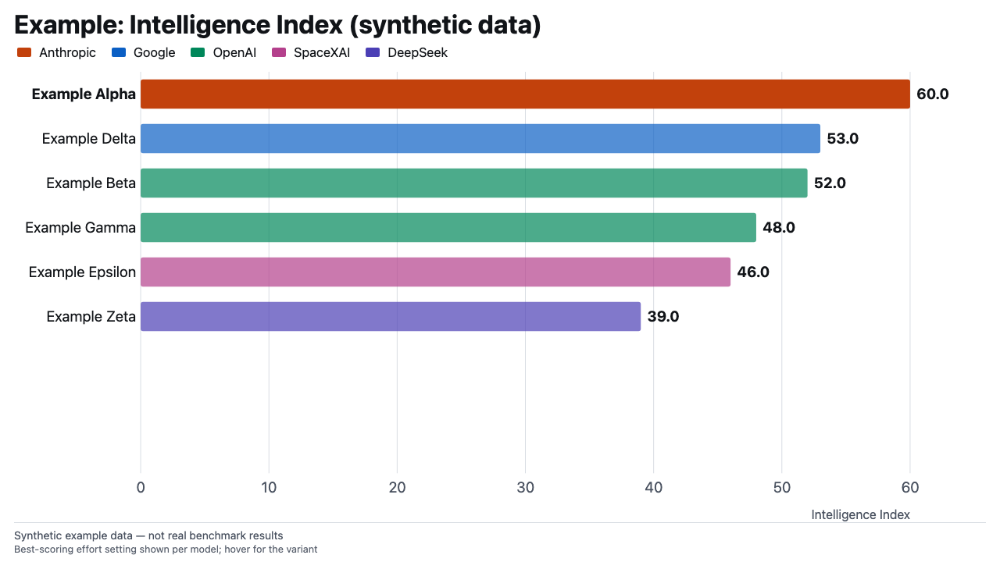
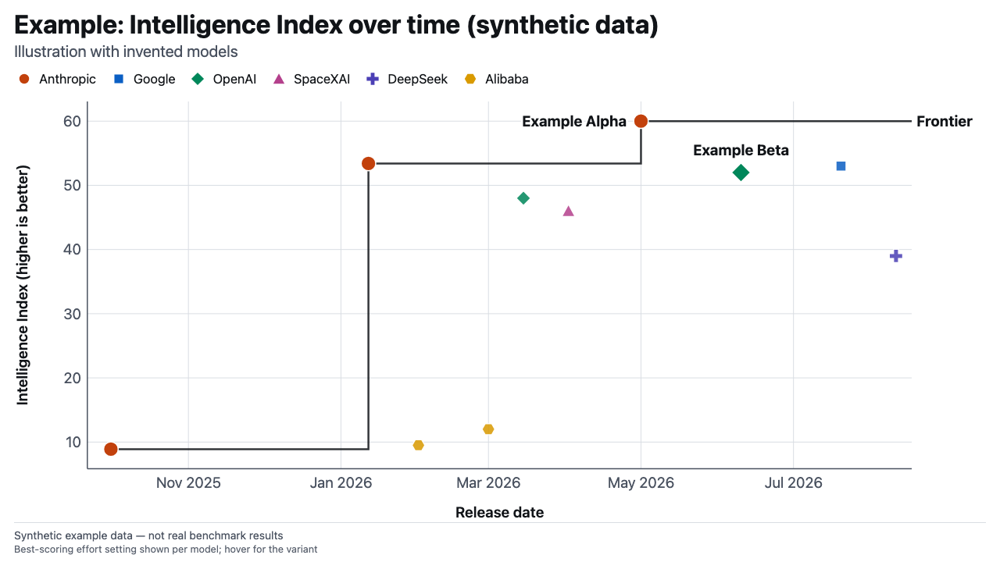
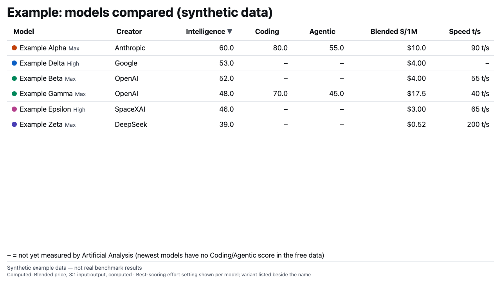

# ai-model-benchmarks

An agent skill that fetches free AI model benchmark data and builds comparison charts as a single self-contained HTML file, for use in slides or documents. It also answers "does this model, for example an open model I might run locally, have benchmark data and a licence?"

Charts: model progress over time (frontier), price or speed against intelligence (scatter), leaderboard bar, multi-metric table, and OpenRouter usage share. Media rankings (text-to-image, video, speech) are supported too.

## Data sources

| Source | What it gives | Terms |
|---|---|---|
| [Artificial Analysis](https://artificialanalysis.ai) API | intelligence, coding and agentic indexes, price, speed, media Elo | free API key; attribution required; raw snapshots must not be republished |
| Arena (Hugging Face dataset `lmarena-ai/leaderboard-dataset`) | human-preference ratings and each model's licence | CC BY 4.0 |
| OpenRouter public exports | 30-day token share, benchmark accuracy, cost per task | CC BY 4.0 |

Attribution is built into every widget footer and cannot be turned off. Arena and OpenRouter need no key.

## What you need

- Python 3 (standard library only).
- A free Artificial Analysis API key, from a free account at <https://artificialanalysis.ai> (generate it in the API section), exported as `ARTIFICIAL_ANALYSIS_API_KEY`. The free tier allows 100 requests per 24 hours; a full language fetch uses 4.
- Optional and advanced: the key can instead come from Bitwarden Secrets Manager (`key_source: bws`); see `SKILL.md`.
- Optional: copy `config.example.json` to `config.local.json` to rename the variable or point `icons_dir` at logo files you supply. No logos are bundled.

## What the output looks like

The widgets below are screenshots of examples built from synthetic data (invented models, not real results).







## What's in this folder

- `SKILL.md` - the procedure, options and terms.
- `scripts/` - `aa_fetch.py` and `open_sources_fetch.py` (fetch), `aa_widget.py` with `widget_template.html` (build), `aa_lookup.py` (model lookup), plus `aa_sources.py` (adapters that turn Arena and OpenRouter data into the record shape the widget uses), `aa_logos.py` (optional company logos from an icon folder you supply) and `aa_key.py` (reads the API key and config; the only module that touches credentials).
- `references/fields.md` - metric aliases and field map.
- `config.example.json` - template for local configuration.
- `tests/` - unit tests using synthetic fixtures. The browser render tests are skipped unless `PLAYWRIGHT_CORE` (path to playwright-core) and `CHROME_HEADLESS_SHELL` (path to a chrome-headless-shell binary) are set.
- `docs/` - the example images above.

## How to use it

Put the folder where your agent looks for skills and ask for a model comparison. Or run the scripts directly:

```bash
mkdir -p assets
python3 -I scripts/aa_fetch.py
python3 -I scripts/aa_widget.py bar --top 10 --out assets/bar-intelligence-top-10.html
python3 -I scripts/aa_lookup.py "model name"
```

Arena (human-preference ratings, open models only) and OpenRouter (30-day usage share) need no key:

```bash
python3 -I scripts/open_sources_fetch.py --source arena
python3 -I scripts/aa_widget.py bar --source arena --open-only --top 10 --out assets/arena-open-models-top-10.html

python3 -I scripts/open_sources_fetch.py --source openrouter
python3 -I scripts/aa_widget.py share --source openrouter --out assets/openrouter-token-share-30-days.html
```

`aa_lookup.py` is the open-model lookup. It searches the local snapshots for a model and reports its ranks, missing fields and, from Arena, its licence. Run the tests with `python3 -I -m unittest discover -s tests`.

## Caveats

- Fetched Artificial Analysis snapshots are saved under `snapshots/`. Do not publish or commit them; widgets that display the data with attribution are fine to share.
- The free Artificial Analysis tier has no per-benchmark scores, context window, licence or open-weights field. Nulls mean "not measured" and are skipped, never plotted as zero.
- Scores from different Intelligence Index versions are not comparable.
- Logos, where you supply them, are brand marks owned by their companies.

## Licence

MIT, as for the rest of this repository (see the LICENSE file at the repository root).
